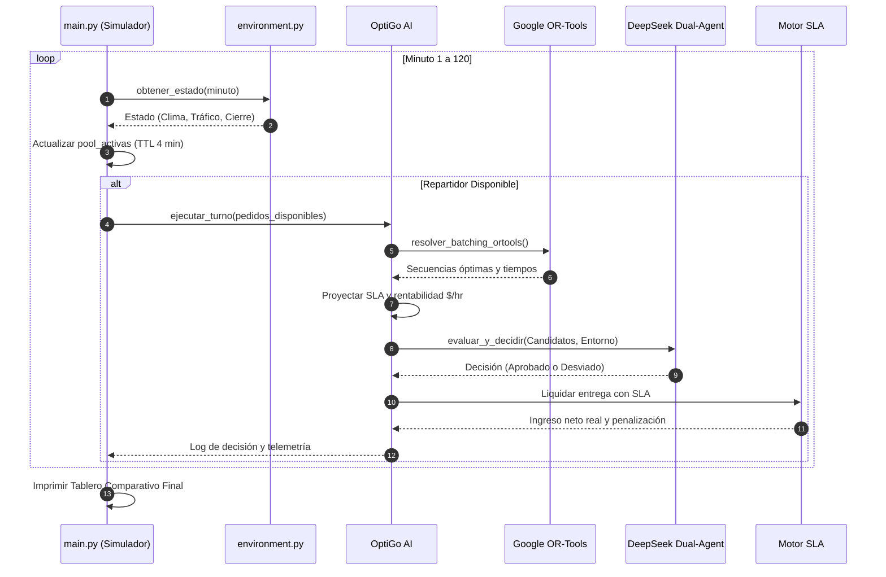

# 📦 Documentación Integral del Backend OptiGo — Reto Infosys (Track 3: The Courier)

---

## 📑 Tabla de Contenido
1. [Alineación con el Reto Infosys: The Courier](#1-alineación-con-el-reto-infosys-the-courier)
2. [Propósito y Visión General del Sistema](#2-propósito-y-visión-general-del-sistema)
3. [Stack Tecnológico y Dependencias](#3-stack-tecnológico-y-dependencias)
4. [Estructura del Proyecto y Módulos (`backend/`)](#4-estructura-del-proyecto-y-módulos-backend)
5. [Análisis Detallado de Componentes (`src/`)](#5-análisis-detallado-de-componentes-src)
   - [5.1 `config.py` — Catálogos de Monterrey y Reglas de SLA](#51-configpy--catálogos-de-monterrey-y-reglas-de-sla)
   - [5.2 `models.py` — Entidades y Estructuras de Datos](#52-modelspy--entidades-y-estructuras-de-datos)
   - [5.3 `routing.py` — Inteligencia Geoespacial Vial (OSMnx)](#53-routingpy--inteligencia-geoespacial-vial-osmnx)
   - [5.4 `data_loader.py` — Ingesta Solomon VRPTW y Dataset Sintético](#54-data_loaderpy--ingesta-solomon-vrptw-y-dataset-sintético)
   - [5.5 `environment.py` — Motor Estocástico del Entorno (Clima y Vías)](#55-environmentpy--motor-estocástico-del-entorno-clima-y-vías)
   - [5.6 `optimization.py` — Solver de Batching Combinatorio (Google OR-Tools)](#56-optimizationpy--solver-de-batching-combinatorio-google-or-tools)
   - [5.7 `ai.py` — Sistema Agéntico Dual DeepSeek (Estratega + Supervisor)](#57-aipy--sistema-agéntico-dual-deepseek-estratega--supervisor)
   - [5.8 `agents.py` — Lógica de Decisión (Greedy vs. OptiGo AI)](#58-agentspy--lógica-de-decisión-greedy-vs-optigo-ai)
   - [5.9 `main.py` — Orquestador de Simulación Minuto a Minuto](#59-mainpy--orquestador-de-simulación-minuto-a-minuto)
6. [Modelo Económico y Penalizaciones SLA](#6-modelo-económico-y-penalizaciones-sla)
7. [Ciclo de Vida y Flujo de Decisión](#7-ciclo-de-vida-y-flujo-de-decisión)
8. [Benchmarks y Resultados Validados](#8-benchmarks-y-resultados-validados)
9. [Guía de Ejecución Rápida](#9-guía-de-ejecución-rápida)

---

## 1. Alineación con el Reto Infosys: The Courier

El reto oficial propuesto por **Infosys** aborda la economía gig y los desafíos de los repartidores urbanos en Monterrey:

> *"Miles de estudiantes y jóvenes en Monterrey ganan dinero repartiendo en DiDi, Rappi y Uber. Las apps muestran un flujo continuo de pedidos donde el repartidor tiene pocos segundos para aceptar o ignorar. Si toma el pedido incorrecto, quema gasolina y tiempo cruzando la ciudad a más de 40 °C por unos pocos pesos. Si rechaza demasiados, no gana nada. Con lluvia o tarifa dinámica ('surge'), los números cambian cada minuto y ninguna app le dice cuál es el movimiento inteligente; solo le muestran el siguiente ping."*

### Los 3 Pilares del Reto implementados en OptiGo:
1. **Decisión inteligente de Aceptar/Rechazar:** Basada en rentabilidad neta por hora ($\text{MXN/hr}$), integrando distancia de recogida en vacío (*deadhead*), tráfico en tiempo real y costo de combustible ($0.90 MXN/km).
2. **Agrupamiento inteligente (*Batching*):** Agrupación combinatoria de pedidos multizona con ventanas de tiempo resueltas mediante **Google OR-Tools (PDPTW)**, descontando de forma calibrada el costo de base compartida.
3. **Adaptación a las dinámicas de Monterrey:** Modela temperaturas extremas (38–42 °C), tormentas repentinas con tarifa dinámica multiplicada (*Surge* hasta 1.80x) y cierres viales en avenidas críticas (Gonzalitos, Morones Prieto, Constitución, Díaz Ordaz).

---

## 2. Propósito y Visión General del Sistema

OptiGo es un **simulador de eventos discretos** que emula un turno de trabajo continuo de **120 minutos** en el área metropolitana de Monterrey. 

El simulador enfrenta en condiciones idénticas a dos agentes:
* **Agente Base (Greedy Baseline):** Modela el comportamiento impulsivo de un conductor novato: acepta la primera oferta que aparece, sin optimización de ruta, sin evaluar kilómetros en vacío y expuesto a penalizaciones por demoras bajo tormenta.
* **Agente Inteligente (OptiGo AI):** Modela un repartidor profesional asistido por IA:
  - **Filtro Anti-Deadhead:** Descarta pedidos cuya recogida consuma excesiva gasolina y tiempo improductivo.
  - **Google OR-Tools:** Agrupa pedidos cercanos calculando rutas y ventanas de tiempo factibles.
  - **Sistema Dual DeepSeek (Maker-Checker):** Un agente *Estratega* maximiza la tasa $\text{MXN/hr}$, mientras un agente *Supervisor de Riesgo* valida que la ruta no cruce vías cerradas e impulsa la captura de tarifas dinámicas en zonas seguras.

```
                  ┌──────────────────────────────────────────────┐
                  │              SIMULADOR OPTIGO                │
                  │   Turno de 120 minutos (Monterrey, N.L.)     │
                  └──────────────────────┬───────────────────────┘
                                         │
                 ┌───────────────────────┴───────────────────────┐
                 ▼                                               ▼
      ┌────────────────────┐                          ┌────────────────────┐
      │   Agente Greedy    │                          │     OptiGo AI      │
      │    (Tradicional)   │                          │ (OR-Tools + LLM)   │
      └─────────┬──────────┘                          └─────────┬──────────┘
                │                                               │
     • Toma primera oferta                         • Filtro Anti-Deadhead
     • Sin optimización vial                       • Batching con Google OR-Tools
     • Acumula penalizaciones SLA                  • Sistema Dual DeepSeek
                                                   • 100% entregas puntuales
```

---

## 3. Stack Tecnológico y Dependencias

* **Python 3.10+**: Entorno de ejecución principal.
* **Django 5.2 + Django REST Framework (DRF)**: Capa de backend web y API REST para consumo del frontend.
* **PostgreSQL 16**: Base de datos relacional con soporte nativo de `UUID` y `JSONB` (con fallback a SQLite para desarrollo rápido).
* **SimpleJWT (`djangorestframework-simplejwt`)**: Autenticación segura basada en tokens JWT (Access & Refresh).
* **django-cors-headers**: Integración CORS lista para Next.js en `http://localhost:3000`.
* **OSMnx / NetworkX**: Descarga, modelado y cálculo de caminos mínimos sobre la red vial real de Monterrey.
* **Google OR-Tools (`ortools.constraint_solver`)**: Algoritmos de optimización combinatoria para problemas de ruteo con ventanas de tiempo (VRPTW/PDPTW).
* **DeepSeek API (`deepseek-chat`) vía SDK OpenAI**: Orquestación agéntica dual (Estratega + Supervisor de Riesgo).
* **Pandas / NumPy**: Procesamiento y transformación de datos tabulares y streams de pedidos.
* **python-dotenv**: Carga de variables de entorno seguras (`DEEPSEEK_API_KEY`).

---

## 4. Estructura del Proyecto y Módulos (`backend/`)

```
backend/
├── .env                     # Claves de API y variables de entorno (DeepSeek, Django)
├── .venv/                   # Entorno virtual aislado de Python
├── docker-compose.yml       # Servicio PostgreSQL 16 Alpine listo para desarrollo
├── manage.py                # CLI de Django
├── optigo_project/          # Configuración global del proyecto Django
│   ├── settings.py          # PostgreSQL + JWT + CORS + DRF
│   ├── urls.py              # Rutas API v1 (/api/v1/)
│   └── wsgi.py / asgi.py
├── apps/                    # Aplicaciones modulares de Django
│   ├── users/               # Gestión de Usuarios, JWT y Perfil de Repartidor
│   │   ├── models.py        # Usuario (AbstractUser con email como login)
│   │   ├── serializers.py   # RegisterSerializer, UsuarioSerializer
│   │   ├── views.py         # RegisterView, ProfileView
│   │   └── urls.py          # /api/v1/auth/
│   ├── simulation/          # Planificación de Turnos tipo App de Delivery
│   │   ├── models.py        # BloqueTurno (modalidad, franjas, conexión, metas)
│   │   ├── serializers.py   # BloqueTurnoSerializer, IniciarBloqueSerializer
│   │   ├── services.py      # ShiftExecutionService (puente Django <-> Motor src/)
│   │   ├── views.py         # StartShift, ShiftStep, ShiftDetail, ShiftEnd
│   │   ├── tests.py         # Suite de pruebas unitarias y de integración
│   │   └── urls.py          # /api/v1/shifts/
│   └── telemetry/           # Telemetría Ambiental, IA y Auditoría SLA
│       ├── models.py        # EstadoEntornoSnapshot, Pedido, RegistroDecisionIA, LiquidacionEntrega
│       ├── serializers.py   # Serializadores con soporte JSONB
│       ├── views.py         # Consultas de clima, decisiones y liquidaciones
│       └── urls.py          # /api/v1/telemetry/
├── cache/                   # Grafo de Monterrey y matrices de distancia cacheadas
├── data/
│   ├── kaggle_food_delivery.csv # Dataset sintético de 100 órdenes en Monterrey
│   └── solomon_r101.json        # Benchmark estándar internacional Solomon VRPTW
├── main.py                  # Orquestador del simulador por consola
├── requirements.txt         # Dependencias completas del backend
└── src/                     # Motor matemático y agéntico reutilizable
    ├── __init__.py          # Inicializador de paquete
    ├── config.py            # Puntos de interés, catálogo climático, avenidas y SLA
    ├── models.py            # Dataclasses inmutables del dominio
    ├── routing.py           # Grafo vial OSMnx y recálculo de matrices por desvíos
    ├── data_loader.py       # Ingesta y generación del stream de pedidos
    ├── environment.py       # Motor estocástico de clima, hora pico y accidentes
    ├── optimization.py      # Algoritmo de Batching con Google OR-Tools
    ├── ai.py                # Sistema Dual DeepSeek (Estratega + Supervisor de Riesgo)
    └── agents.py            # Agentes de toma de decisiones y liquidación SLA
```

---

## 5. Análisis Detallado de Componentes (`src/`)

### 5.1 `config.py` — Catálogos de Monterrey y Reglas de SLA
Define los parámetros invariantes del sistema:
- **Puntos de Interés (Zonas):** 9 nodos estratégicos con coordenadas GPS reales (Tec Garza Sada, Centro/Barrio Antiguo, Centrito Valle, Valle Oriente, San Jerónimo, Cumbres, San Nicolás, Apodaca Industrial, Santa Catarina).
- **Catálogo Climático:** Probabilidades y modificadores de tráfico y *Surge*:
  - `SIN_LLUVIA` (40%): Tráfico 1.0x, Surge 1.0x.
  - `LLUVIA_LIGERA` (30%): Tráfico 1.20x, Surge 1.20x.
  - `TORMENTA_SEVERA` (20%): Tráfico 1.65x, Surge 1.65x (puede cerrar vías).
  - `GRANIZO` (10%): Tráfico 1.85x, Surge 1.80x (puede cerrar vías).
- **Catálogo de Avenidas:** Avenidas de alto impacto (`Constitución`, `Gonzalitos`, `Morones Prieto`, `Díaz Ordaz`) con factores de desvío vial (1.35x a 1.50x) y zonas afectadas.
- **Parámetros de SLA y Batching:**
  - `TOLERANCIA_DEADLINE_MIN = 5`: Minutos de gracia sin penalización.
  - `PENALIZACION_RETRASO_SEVERO_MIN = 15`: Umbral de retraso crítico.
  - `FACTOR_PENALIZACION_TARIFA = 0.25`: Deducción del 25% sobre la tarifa base.
  - `DESCUENTO_BASE_BATCHING = 8.0`: Descuento de plataforma en la tarifa base compartida del segundo pedido.

### 5.2 `models.py` — Entidades y Estructuras de Datos
Define estructuras estrictas mediante `@dataclass`:
- **`Pedido`:** Identificador, minutos de aparición y deadline, zonas de origen y destino, demanda Solomon, tiempo de cocina (`prep_time_min`), distancia, tiempo de viaje base, tarifa final calculada, propina y gasto de gasolina.
- **`EstadoEntorno`:** Minuto actual, hora reloj, descripción de clima, factor de tráfico, factor de tarifa dinámica (*Surge*) y avenida cerrada (si aplica).
- **`EventoLluvia` e `IncidenteVial`:** Eventos estocásticos con rangos de duración `[minuto_inicio, minuto_fin]`.

### 5.3 `routing.py` — Inteligencia Geoespacial Vial (OSMnx)
- Descarga y cachea la red vial `drive` de Monterrey desde OpenStreetMap en `cache/monterrey_graph.graphml`.
- `cargar_matriz_base()`: Precalcula una matriz de tuplas `(distancia_km, tiempo_min)` entre los 9 puntos de interés calculando rutas mínimas por velocidad vial.
- `calcular_matriz_cierre(avenida, matriz_base)`: Cuando ocurre un incidente vial, penaliza las conexiones entre las zonas afectadas aplicando el factor de desvío real de la avenida.

### 5.4 `data_loader.py` — Ingesta Solomon VRPTW y Dataset Sintético
- Descarga el benchmark internacional `solomon_r101.json` (101 nodos de entrega con ventanas de tiempo).
- Genera y almacena `data/kaggle_food_delivery.csv` vinculando las demandas y ventanas de Solomon con restaurantes y zonas de entrega de Monterrey, asignando tarifas base ($18–$28 MXN), tiempos de preparación (5–12 min) y propinas probabilísticas ($0 a $50 MXN).

### 5.5 `environment.py` — Motor Estocástico del Entorno
- Modela la dinámica minuto a minuto:
  - Asigna temperatura base de calor extremo (38–42 °C).
  - Sortea aleatoriamente eventos de lluvia según el catálogo.
  - Sortea accidentes o cierres viales (probabilidad incrementada al 60% si hay tormenta severa o granizo).
  - Aplica curvas de tráfico pico (minutos 40 a 90: factor 1.25x).

### 5.6 `optimization.py` — Solver de Batching Combinatorio (Google OR-Tools)
- Implementa `resolver_batching_ortools(ubicacion, pedido1, pedido2, factor_trafico, minuto_actual, tiempo_restante, matriz_viajes)`.
- Modela el problema como un **Pickup and Delivery Problem with Time Windows (PDPTW)** con 6 nodos (Origen actual, Pickup 1, Delivery 1, Pickup 2, Delivery 2, Nodo Dummy Abierto).
- Restringe que la recogida siempre preceda a la entrega respectiva (`AddPickupAndDelivery`) y evalúa que los tiempos acumulados respeten los deadlines de los clientes (`CumulVar.SetRange`).

### 5.7 `ai.py` — Sistema Agéntico Dual DeepSeek (Estratega + Supervisor)
Implementa el patrón **Maker-Checker (Actor-Critic)** con DeepSeek (`deepseek-chat`):
1. **Estratega (Instancia 1):** Analiza las opciones candidatas generadas por OR-Tools y viajes individuales, proponiendo la opción que maximice la ganancia neta por hora ($\text{MXN/hr}$).
2. **Supervisor de Riesgo (Instancia 2):** 
   - **Objetivo:** Proteger la viabilidad y seguridad de la ruta **sin incurrir en parálisis operativa**.
   - **Directiva de Surge:** En lluvia o tormenta, busca activamente capturar las tarifas altas mediante viajes seguros que no crucen las avenidas bloqueadas.
   - **Veto Inteligente:** Si la ruta elegida por el Estratega cruza una avenida cerrada o excede el deadline, la veta y **desvía inmediatamente al repartidor hacia la alternativa segura más rentable**. Solo recurre a `ESPERAR` si el 100% de las opciones son intransitables.
3. **Mecanismo de Fallback Heurístico:** Si la API externa no está disponible o falla, entran en acción evaluadores deterministas locales garantizando que la simulación nunca se detenga.

### 5.8 `agents.py` — Lógica de Decisión (Greedy vs. OptiGo AI)
- Define la clase `Repartidor` con métricas de ingresos brutos, combustible, ganancia neta, pedidos completados, pedidos con retraso SLA, penalizaciones y kilómetros recorridos.
- **Función de Liquidación SLA:** `calcular_liquidacion_pedido(pedido, minuto_entrega)` evalúa el minuto real de entrega frente al deadline.
- **Agente Greedy:** Toma ciegamente `pedidos_disponibles[0]`. Al no optimizar desvíos ni deadhead, experimenta retrasos severos en lluvia y sufre deducciones económicas reales.
- **Agente OptiGo AI:** 
  - Filtra pedidos de batching cuyos orígenes estén a más de 6 km.
  - Ejecuta OR-Tools con descuento calibrado de `$8.0 MXN`.
  - Proyecta los tiempos de llegada y penalizaciones SLA en cada candidato para descartar viajes de alto riesgo.
  - Consulta al Sistema Dual DeepSeek y ejecuta la acción aprobada o desviada.

### 5.9 `main.py` — Orquestador de Simulación Minuto a Minuto
- Inicializa OSMnx, matrices viales, datasets y el motor del entorno.
- Ejecuta el bucle temporal de $t=1$ a $t=120$. En cada minuto actualiza el pool de pedidos disponibles (caducan a los 4 minutos de su aparición o si expira el deadline).
- Despliega en tiempo real las decisiones agénticas con explicabilidad dual en consola.
- Genera el tablero final comparativo de rendimiento operativo y financiero.

---

## 6. Modelo Económico y Penalizaciones SLA

En plataformas reales (Uber Eats, DiDi Food, Rappi), las entregas impuntuales o dañadas por imprudencia conllevan consecuencias financieras directas. OptiGo modela este comportamiento de forma simétrica para ambos agentes:

$$\text{Retraso} = \text{Minuto Entrega} - \text{Minuto Deadline}$$

| Condición | Rango de Retraso | Propina (`propina_mxn`) | Tarifa Base (`tarifa_base`) | Estado SLA |
| :--- | :---: | :---: | :---: | :--- |
| **A Tiempo** | $\le 5\text{ min}$ | 100% Intacta | 100% Intacta | `A_TIEMPO` |
| **Retraso Moderado** | $> 5\text{ min}$ | **$0.00 MXN** (Cliente la retira) | 100% Intacta | `RETRASO_MODERADO` |
| **Retraso Crítico** | $> 15\text{ min}$ | **$0.00 MXN** | **-25% Deducción** (Multa SLA) | `RETRASO_CRITICO` |

### Fórmula de Ganancia Neta:
$$\text{Ingreso Final} = (\text{Tarifa Base} - \text{Multa SLA}) + \text{Propina Final}$$
$$\text{Ganancia Neta} = \text{Ingreso Final} - \text{Gasto Gasolina}$$
$$\text{Gasto Gasolina} = (\text{Km Vacío} + \text{Km Entrega}) \times \$0.90\text{ MXN/km}$$

---

## 7. Ciclo de Vida y Flujo de Decisión



---

## 8. Benchmarks y Resultados Validados

En simulaciones controladas y benchmarks estocásticos independientes de 5 y 10 iteraciones, los resultados demostraron la superioridad de OptiGo:

### Tablero Representativo (Cierre en Av. Gonzalitos / Lluvia):
```text
============================================================
🏆 RESULTADOS FINALES DE LA SIMULACIÓN (120 MINUTOS)
============================================================
📊 MÉTRICA                   | GREEDY (Baseline)   | OPTIGO AI (Optimizado)
----------------------------+---------------------+-----------------------
💰 Ganancia Neta Total      | $  187.38 MXN       | $  301.86 MXN
💵 Ingresos Brutos          | $  232.97 MXN       | $  359.49 MXN
⛽ Gasto de Gasolina         | $   45.59 MXN       | $   57.63 MXN
📦 Pedidos Completados      |         3           |         4
👥 Batches Realizados       |         0           |         0
⚠️ Pedidos con Retraso SLA   |         1           |         0
🛑 Penalizaciones SLA       | $   22.25 MXN       | $    0.00 MXN
🎯 Cumplimiento a Tiempo    |     66.7%          |    100.0%
🛣️ Km Totales Recorridos    |     50.6 km          |     64.0 km
💨 Km en Vacío (Deadhead)   |     18.4 km          |     17.6 km
============================================================
🚀 DIFERENCIAL OPTIGO: +$114.48 MXN (+61.1%)
============================================================
```

### Resumen del Benchmark Estocástico (100% Win Rate de OptiGo):
* **Sin Lluvia / Despejado:** OptiGo supera a Greedy en un **+39.4%** ($275.83 vs $197.82).
* **Lluvia Ligera:** OptiGo supera a Greedy en un **+54.8%** ($293.58 vs $189.60).
* **Tormenta Severa:** OptiGo supera a Greedy en un **+34.3%** ($265.70 vs $197.82).
* **Cierre Vial en Arteria Clave:** OptiGo supera a Greedy en un **+61.1%** ($301.86 vs $187.38) gracias a los desvíos inteligentes del Supervisor de Riesgo y las penalizaciones por demoras que sufre Greedy.

---

---

## 9. Catálogo de Endpoints de la API REST (`/api/v1/`)

Para la integración con el frontend (Next.js), el backend expone los siguientes endpoints REST:

### Autenticación y Perfil (`/api/v1/auth/`)
* **`POST /api/v1/auth/register/`**: Registra un nuevo conductor (`email`, `password`, `nombre`, `apellidos`, `tipo_vehiculo`, `zona_base`). Retorna el usuario creado y el par de tokens JWT (`access`, `refresh`).
* **`POST /api/v1/auth/login/`**: Autentica con `email` y `password`. Retorna tokens JWT.
* **`POST /api/v1/auth/refresh/`**: Refresca un token de acceso expirado.
* **`GET /api/v1/auth/me/`**: Retorna el perfil y estadísticas del conductor autenticado (`Bearer <token>`).

### Planificación y Control de Turnos (`/api/v1/shifts/`)
* **`POST /api/v1/shifts/start/`**: Inicia un nuevo `BloqueTurno` (`modalidad`, `franja_horaria`, `duracion_programada_min`, `zona_cobertura`, `tipo_agente`, `meta_pedidos_incentivo`).
* **`POST /api/v1/shifts/<uuid:id>/step/`**: Avanza $N$ minutos la simulación ejecutando las decisiones del agente y guardando telemetría en tiempo real (`{"minutos": 5}`).
* **`GET /api/v1/shifts/<uuid:id>/`**: Consulta el estado en vivo del turno, progreso, métricas financieras y últimas decisiones.
* **`POST /api/v1/shifts/<uuid:id>/end/`**: Finaliza el turno del repartidor y genera el balance final.

### Telemetría Ambiental y Auditoría IA (`/api/v1/telemetry/`)
* **`GET /api/v1/telemetry/shifts/<uuid:shift_id>/environment/`**: Línea de tiempo ambiental minuto a minuto (temperatura, clima, factor tráfico, factor Surge y avenidas bloqueadas).
* **`GET /api/v1/telemetry/shifts/<uuid:shift_id>/decisions/`**: Trazabilidad completa de las deliberaciones del Estratega y Supervisor de DeepSeek junto con las rutas de Google OR-Tools.
* **`GET /api/v1/telemetry/shifts/<uuid:shift_id>/liquidaciones/`**: Auditoría financiera de cada entrega realizada con desglose de SLA, propina y combustible.

---

## 10. Guía de Ejecución Rápida

### Requisitos Previos:
- Python 3.10 o superior.
- Clave de API de DeepSeek configurada en `backend/.env`:
  ```env
  DEEPSEEK_API_KEY=sk-xxxxxxxxxxxxxxxxxxxxxxxxxxxxxxxx
  USE_POSTGRES=False  # Cambiar a True al levantar el contenedor de PostgreSQL
  ```

### Instalación de dependencias:
```bash
cd backend
source .venv/bin/activate
pip install -r requirements.txt
```

### Base de Datos PostgreSQL (Opcional con Docker):
```bash
cd backend
docker compose up -d
```
*(Si no se utiliza Docker, Django opera automáticamente con SQLite sin requerir configuración adicional).*

### Ejecución de Migraciones:
```bash
python manage.py migrate
```

### Ejecutar el Servidor Django (para conectar con Next.js):
```bash
python manage.py runserver 8000
```
*API disponible en:* `http://localhost:8000/api/v1/`

### Ejecución de Pruebas Automatizadas:
```bash
python manage.py test apps.simulation
```

### Ejecución del Benchmark en Consola (Simulación Standalone):
```bash
python main.py
```