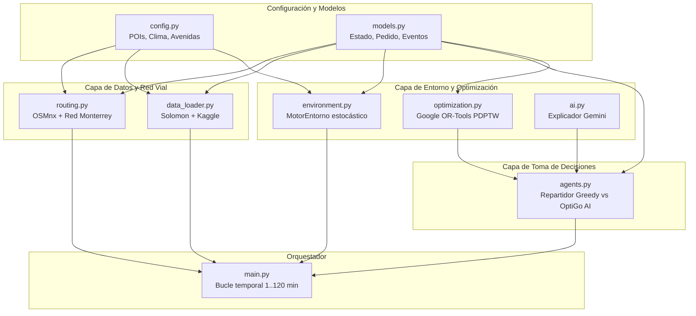
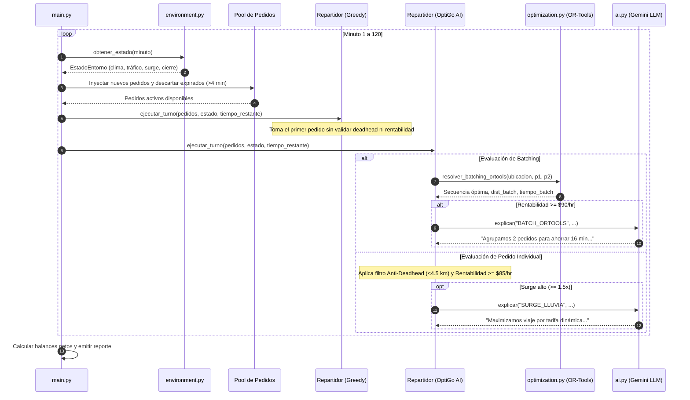

# 📦 Documentación Integral del Backend OptiGo — Reto Infosys (Track 3: The Courier)

---

## 📑 Tabla de Contenido
1. [Alineación con el Reto Infosys: The Courier](#1-alineación-con-el-reto-infosys-the-courier)
2. [Propósito y Visión General del Backend](#2-propósito-y-visión-general-del-backend)
3. [Requisitos y Dependencias del Sistema](#3-requisitos-y-dependencias-del-sistema)
4. [Estructura del Proyecto y Archivos](#4-estructura-del-proyecto-y-archivos)
5. [Análisis Detallado de Componentes Individuales](#5-análisis-detallado-de-componentes-individuales)
   - [5.1 `config.py` — Configuración y Catálogos de Monterrey](#51-configpy--configuración-y-catálogos-de-monterrey)
   - [5.2 `models.py` — Estructuras de Datos y Entidades](#52-modelspy--estructuras-de-datos-y-entidades)
   - [5.3 `routing.py` — Inteligencia Geoespacial y Red Vial (OSMnx)](#53-routingpy--inteligencia-geoespacial-y-red-vial-osmnx)
   - [5.4 `data_loader.py` — Ingesta de Benchmarks y Generación de Pedidos](#54-data_loaderpy--ingesta-de-benchmarks-y-generación-de-pedidos)
   - [5.5 `environment.py` — Motor Estocástico del Entorno](#55-environmentpy--motor-estocástico-del-entorno)
   - [5.6 `optimization.py` — Algoritmo de Batching Combinatorio (Google OR-Tools)](#56-optimizationpy--algoritmo-de-batching-combinatorio-google-or-tools)
   - [5.7 `ai.py` — Explicabilidad y Copiloto LLM (Google Gemini)](#57-aipy--explicabilidad-y-copiloto-llm-google-gemini)
   - [5.8 `agents.py` — Lógica de Decisión (Greedy Baseline vs. OptiGo AI)](#58-agentspy--lógica-de-decisión-greedy-baseline-vs-optigo-ai)
   - [5.9 `main.py` — Orquestador de Simulación Minuto a Minuto](#59-mainpy--orquestador-de-simulación-minuto-a-minuto)
6. [Interacción entre Componentes y Flujo de Ejecución](#6-interacción-entre-componentes-y-flujo-de-ejecución)
7. [Métricas de Evaluación y Criterios del Jurado](#7-métricas-de-evaluación-y-criterios-del-jurado)
8. [Guía de Ejecución Rápida](#8-guía-de-ejecución-rápida)

---

## 1. Alineación con el Reto Infosys: The Courier

El reto oficial propuesto por **Infosys** plantea resolver un problema crítico en la economía gig de Monterrey:

> *"Miles de estudiantes y jóvenes en Monterrey ganan dinero repartiendo en DiDi, Rappi y Uber. Las apps muestran un flujo continuo de pedidos donde el repartidor tiene pocos segundos para aceptar o ignorar. Si toma el pedido incorrecto, quema gasolina y tiempo cruzando la ciudad a más de 40 °C por unos pocos pesos. Si rechaza demasiados, no gana nada. Con lluvia o tarifa dinámica ('surge'), los números cambian cada minuto y ninguna app le dice cuál es el movimiento inteligente; solo le muestran el siguiente ping."*

### Los 3 Enfoques del Reto y su Implementación en el Backend:
1. **Decisión inteligente de Aceptar/Rechazar:** Basada en rentabilidad real por hora ($\text{MXN/hr}$), considerando distancias en vacío (*deadhead*), tiempo de tráfico real y costo de gasolina.
2. **Agrupamiento inteligente (*Batching*):** Agrupa entregas cercanas y planifica rutas eficientes por las calles de Monterrey usando **Google OR-Tools (PDPTW)**.
3. **Adaptación a las dinámicas de la ciudad:** Respuesta ante calor extremo (38–42 °C), lluvias repentinas que disparan la tarifa dinámica (Surge) y accidentes/cierres en arterias clave (Gonzalitos, Constitución, Morones Prieto, Díaz Ordaz).

---

## 2. Propósito y Visión General del Backend

El backend es un **simulador de eventos discretos** que emula un turno real de delivery de **120 minutos** en el área metropolitana de Monterrey. 

Su función principal es ejecutar en paralelo dos agentes en el mismo turno idéntico:
* **Agente Base (Greedy):** Modela el comportamiento impulsivo o novato: toma la primera orden disponible sin optimización de ruta, sin medir costos de gasolina de pickup ni agrupar pedidos.
* **Agente Inteligente (OptiGo AI):** Modela un repartidor profesional asistido por IA: filtra pedidos poco rentables, evita cruzar la ciudad en vacío, aprovecha tarifas dinámicas y calcula agrupamientos multizona con restricciones de tiempo.

```
                  ┌──────────────────────────────────────────────┐
                  │              SIMULADOR OPTIGO                │
                  │   Turno de 120 minutos (Monterrey, N.L.)     │
                  └──────────────────────┬───────────────────────┘
                                         │
                 ┌───────────────────────┴───────────────────────┐
                 ▼                                               ▼
      ┌────────────────────┐                          ┌────────────────────┐
      │   Agente Greedy    │                          │     OptiGo AI      │
      │   (Tradicional)    │                          │ (OR-Tools + LLM)   │
      └─────────┬──────────┘                          └─────────┬──────────┘
                │                                               │
     • Toma primera oferta                         • Filtro Anti-Deadhead
     • Sin agrupamiento                            • Batching con OR-Tools
     • Quema combustible en vacío                  • Caza de Surge con precaución
                │                                               │
                └───────────────────────┬───────────────────────┘
                                        ▼
                  ┌──────────────────────────────────────────────┐
                  │    Comparativa Financiera y Telemetría      │
                  │  (Ganancia Neta, Km en Vacío, Explicación)   │
                  └──────────────────────────────────────────────┘
```

---

## 3. Requisitos y Dependencias del Sistema

### 3.1 Entorno de Ejecución
* **Python:** 3.10 o superior.
* **Sistema Operativo:** Linux / macOS / Windows con soporte de compilación C++ (requerido por OR-Tools).

### 3.2 Dependencias (`requirements.txt`)
* **`osmnx`:** Descarga y modelado del grafo vial real de Monterrey desde OpenStreetMap, cálculo de velocidades y tiempos de viaje.
* **`pandas`:** Gestión y transformación tabular de pedidos e históricos.
* **`ortools`:** Solver de optimización combinatoria de Google para problemas de ruteo de vehículos con ventanas de tiempo (VRPTW / PDPTW).
* **`google-genai`:** SDK de Google para interactuar con los modelos Gemini (Gemini 2.5 Flash) para la generación de explicaciones en lenguaje natural.

### 3.3 Variables de Entorno (Opcional)
* `GEMINI_API_KEY`: Clave de API de Google AI Studio. Si no está configurada, el backend utiliza un motor de explicabilidad determinista alternativo para evitar fallos.

---

## 4. Estructura del Proyecto y Archivos

```
backend/
│
├── main.py                     # Punto de entrada y orquestador del ciclo de simulación
├── requirements.txt            # Dependencias de Python del proyecto
├── AGENTS.md                   # Especificación técnica preliminar de agentes
├── DOCUMENTACION_BACKEND.md    # [Este archivo] Documentación técnica integral
│
├── data/                       # Almacén de datasets locales y cacheados
│   ├── kaggle_food_delivery.csv# Dataset sintético calibrado para Monterrey
│   └── solomon_r101.json       # Benchmark estándar de ruteo (VRPTW)
│
├── cache/                      # Caché de grafos y rutas de OSMnx
│   └── *.json
│
└── src/                        # Código fuente modular
    ├── __init__.py             # Inicializador de paquete
    ├── config.py               # Catálogos estáticos, POIs y matrices climáticas
    ├── models.py               # Data classes inmutables
    ├── routing.py              # Extracción de red vial y cálculo de matrices de viaje
    ├── data_loader.py          # Preparación y mapeo de pedidos a zonas locales
    ├── environment.py          # Generador estocástico de clima, tráfico y cierres viales
    ├── optimization.py         # Solver PDPTW con Google OR-Tools para batching
    ├── ai.py                   # Módulo de explicabilidad con Gemini
    └── agents.py               # Implementación de los repartidores (Greedy vs OptiGo)
```

---

## 5. Análisis Detallado de Componentes Individuales

### 5.1 `config.py` — Configuración y Catálogos de Monterrey
Es la fuente única de verdad para las constantes geográficas y dinámicas del entorno:
* **`DURACION_TURNO = 120`:** Define la duración del turno en minutos.
* **`PUNTOS_INTERES` (POIs):** Coordenadas geográficas latitud/longitud de las zonas comerciales y residenciales neurálgicas de Monterrey:
  * *Tec de Monterrey (Garza Sada)*: Punto estudiantil con alto volumen de restaurantes.
  * *Centro MTY (Barrio Antiguo)*: Zona de restaurantes tradicionales.
  * *Centrito Valle y Valle Oriente (San Pedro)*: Zonas de alta plusvalía y propinas elevadas.
  * *San Jerónimo, Cumbres, San Nicolás, Apodaca, Santa Catarina*: Zonas clave para entregas residenciales e industriales.
* **`CATALOGO_LLUVIA`:** Distribución de probabilidad de eventos meteorológicos con impacto en el tráfico y la tarifa dinámica:
  * `SIN_LLUVIA` (40% prob, tráfico 1.0x, surge 1.0x)
  * `LLUVIA_LIGERA` (30% prob, tráfico 1.2x, surge 1.2x)
  * `TORMENTA_SEVERA` (20% prob, tráfico 1.65x, surge 1.65x, riesgo de inundación/cierre)
  * `GRANIZO` (10% prob, tráfico 1.85x, surge 1.80x, visibilidad crítica)
* **`CATALOGO_AVENIDAS` e `IMPACTO_AVENIDAS`:** Modela los cierres en las arterias principales:
  * `Av. Constitución`, `Av. Gonzalitos`, `Av. Morones Prieto`, `Blvd. Díaz Ordaz`.
  * Asocia a cada avenida un factor de desvío (entre +35% y +50% de tiempo extra) y las zonas específicas de la ciudad afectadas.

---

### 5.2 `models.py` — Estructuras de Datos y Entidades
Utiliza `@dataclass` de Python para garantizar consistencia tipada e inmutabilidad lógica:
* **`EstadoEntorno`:** Fotografía del mundo en un minuto dado:
  * `minuto_turno`: Minuto transcurrido ($1..120$).
  * `hora_reloj`: Formato de 12 horas (ej. `01:15 PM`).
  * `clima`: Estado descriptivo del clima.
  * `factor_trafico`: Multiplicador sobre el tiempo de viaje base.
  * `factor_surge`: Multiplicador de tarifa para el repartidor.
  * `avenida_cerrada`: Nombre de la avenida bloqueada en ese instante, si existe.
* **`EventoLluvia` e `IncidenteVial`:** Representan eventos dinámicos temporales con métodos de consulta `activo_en(minuto)`.
* **`Pedido`:** Representa una orden de comida completa:
  * `id_pedido`, `minuto_aparicion`, `minuto_deadline`.
  * `origen` (restaurante) y `destino` (cliente).
  * `tiempo_preparacion_min`: Tiempo de espera en restaurante.
  * `distancia_km`, `tiempo_viaje_min`.
  * `tarifa_final_mxn`, `propina_mxn`, `gasolina_viaje_mxn`.

---

### 5.3 `routing.py` — Inteligencia Geoespacial y Red Vial (OSMnx)
Implementa el mapa vial real de Monterrey conectando con OpenStreetMap:
* **`cargar_matriz_base()`:**
  1. Descarga el grafo vehicular (`network_type="drive"`) de Monterrey utilizando `osmnx.graph_from_place`.
  2. Imputa velocidades promedio según el tipo de vía (`add_edge_speeds`) y calcula tiempos de traslado (`add_edge_travel_times`).
  3. Mapea cada uno de los 9 POIs al nodo vial más cercano en la red.
  4. Ejecuta el algoritmo de camino más corto Dijkstra/A* (`shortest_path`) ponderado por `travel_time` para cada par de zonas $(origen, destino)$.
  5. Construye y retorna un diccionario en memoria con tuplas `(distancia_km, tiempo_minuto)`.
* **`calcular_matriz_cierre(avenida, matriz_base)`:**
  * Si una avenida clave se inunda o se cierra por accidente, genera una matriz vial alternativa penalizando con un desvío del 15% más de distancia y entre 35% y 50% más de tiempo a las zonas conectadas por dicha arteria.

---

### 5.4 `data_loader.py` — Ingesta de Benchmarks y Generación de Pedidos
Combina estándares académicos de logística con variables económicas de México:
* **Solomon VRPTW Benchmark (`r101.json`):**
  * Descarga y parsea la instancia estándar de ruteo con ventanas de tiempo (VRPTW).
  * Extrae ventanas tempranas (`earliest`), ventanas tardías (`latest`) y demandas.
* **Transformación al Contexto Local de Monterrey (`kaggle_food_delivery.csv`):**
  * Asigna los orígenes a nodos gastronómicos reales (ej. Centrito Valle, Garza Sada).
  * Mapea tiempos de llegada adaptados a la simulación de 120 minutos.
  * Introduce variables financieras reales de Monterrey:
    * Tarifa base: $\$18.00 - \$28.00\text{ MXN}$.
    * Pago por km: $\$4.00\text{ MXN/km}$.
    * Propinas estocásticas ponderadas (0, 10, 20, 35, 50 pesos).
    * Costo de combustible: estimado en $\$0.90\text{ MXN por km recorrido}$.

---

### 5.5 `environment.py` — Motor Estocástico del Entorno
Gestiona la física y la incertidumbre del mundo en tiempo real (`MotorEntorno`):
* **Temperatura base:** Selecciona aleatoriamente entre $38\text{ °C}$ y $42\text{ °C}$ (calor extremo regiomontano).
* **Generación de Clima:** Sortea eventos según el catálogo probabilístico (ej. granizo o tormenta que duran entre 15 y 50 minutos).
* **Generación de Incidentes:** Modela accidentes o cierres viales; si hay tormenta severa, la probabilidad de cierre de avenidas sube al 60%.
* **`obtener_estado(minuto)`:** Calcula dinámicamente los factores compuestos para cada minuto del turno:
  $$\text{factor\_trafico} = \text{base\_hora\_pico} \times \text{factor\_lluvia} \times \text{factor\_incidente}$$

---

### 5.6 `optimization.py` — Algoritmo de Batching Combinatorio (Google OR-Tools)
Resuelve el problema de **Pickup and Delivery con Ventanas de Tiempo (PDPTW)** cuando el agente evalúa agrupar 2 pedidos simultáneos:
* Construye un grafo temporal con 6 nodos:
  * `0`: Posición actual del repartidor.
  * `1`: Restaurante Pedido 1 (Pickup 1).
  * `2`: Casa Cliente 1 (Delivery 1).
  * `3`: Restaurante Pedido 2 (Pickup 2).
  * `4`: Casa Cliente 2 (Delivery 2).
  * `5`: Nodo de fin de ruta abierta (*Dummy* de costo cero).
* **Restricciones del Solver:**
  1. Precedencia: El repartidor debe pasar por el restaurante antes de la casa del cliente (`AddPickupAndDelivery`).
  2. Ventanas de tiempo: Las entregas no pueden superar los deadlines prometidos a los clientes (`CumulVar.SetRange`).
  3. Tiempo restante de turno: La ruta total no puede exceder el tiempo que le queda al turno del conductor.
* **Resultado:** Determina si el agrupamiento es viable, la secuencia óptima de paradas (ej. `Ubicación -> Pickup 1 -> Pickup 2 -> Delivery 1 -> Delivery 2`), la distancia total y los minutos necesarios.

---

### 5.7 `ai.py` — Explicabilidad y Copiloto LLM (Google Gemini)
Cumple directamente con el criterio de evaluación de **Juicio y Claridad**:
* Conecta con `gemini-2.5-flash` mediante la API de Google GenAI.
* **`explicar(tipo_decision, detalle, ganancia, ahorro_tiempo)`:**
  * Envía el contexto de telemetría de la decisión tomada a Gemini con un system prompt que le instruye hablar como un copiloto de logística para repartidores.
  * Genera una explicación concisa en una sola frase de por qué se eligió agrupar dos órdenes o por qué se priorizó una entrega durante una tormenta con tarifa dinámica.
  * Si la API no está disponible o no hay conexión, cuenta con generadores locales de respaldo basados en reglas.

---

### 5.8 `agents.py` — Lógica de Decisión (Greedy Baseline vs. OptiGo AI)
Encapsula la clase `Repartidor` con dos estrategias diametralmente opuestas:

#### A) Agente Greedy (Base)
* Escanea el pool de ofertas y toma ciegamente la primera disponible (`pedidos_disponibles[0]`).
* No evalúa la distancia que tiene que recorrer vacante hasta el restaurante (*Deadhead*).
* No realiza *batching* (solo 1 pedido a la vez).
* No analiza si la orden deja una ganancia neta superior al gasto de gasolina.

#### B) Agente OptiGo AI
1. **Fase 1: Búsqueda de Batching (OR-Tools):**
   * Evalúa pares de pedidos cercanos (restaurantes a menos de 6 km entre sí).
   * Llama a OR-Tools para calcular la ruta combinada.
   * Calcula la rentabilidad proyectada por hora:
     $$\text{Rentabilidad} = \frac{\text{Tarifa Total} - \text{Gasolina}}{\text{Minutos del Batch}} \times 60$$
   * Si la rentabilidad proyectada es $\ge \$90.00\text{ MXN/hr}$, acepta el batch y ejecuta la ruta óptima.
2. **Fase 2: Filtro Individual Anti-Deadhead y Rentabilidad:**
   * Si no hay batch disponible, evalúa pedidos individuales.
   * **Filtro Anti-Deadhead:** Descarta cualquier pedido cuyo restaurante esté a más de $4.5\text{ km}$ de distancia vacía, a menos que el *surge* sea $\ge 1.6\text{x}$.
   * **Umbral de Calidad:** Solo acepta si la rentabilidad neta es $\ge \$85.00\text{ MXN/hr}$.

---

### 5.9 `main.py` — Orquestador de Simulación Minuto a Minuto
Coordina todo el ciclo de simulación:
1. **Paso 1:** Inicializa y precalcula la red vial de Monterrey (`routing.py`).
2. **Paso 2:** Genera y carga los datasets de pedidos (`data_loader.py`).
3. **Paso 3:** Instancia el motor de clima y tráfico (`environment.py`).
4. **Paso 4:** Instancia a los dos repartidores (`Greedy` y `OptiGo AI`) en la misma ubicación de partida (`Centro MTY`).
5. **Paso 5 (Bucle de Simulación):**
   * Itera minuto a minuto ($t = 1 \dots 120$).
   * Actualiza el pool de pedidos activos (los pedidos expiran si pasan más de 4 minutos sin ser aceptados o si se vence su deadline).
   * Invoca `ejecutar_turno()` para ambos agentes en paralelo.
   * Imprime en consola los eventos destacados y explicaciones del copiloto de IA.
6. **Paso 6:** Genera el balance final comparativo.

---

## 6. Interacción entre Componentes y Flujo de Ejecución

### 6.1 Diagrama de Dependencias y Capas



---

### 6.2 Diagrama de Secuencia: Ciclo Minuto a Minuto



---

## 7. Métricas de Evaluación y Criterios del Jurado

El backend está diseñado para responder con excelencia a cada uno de los 4 criterios del reto:

| Criterio del Reto | ¿Cómo lo cumple el Backend? | Archivo Clave |
| :--- | :--- | :--- |
| **1. Results (Resultados Financieros)** | OptiGo AI supera sistemáticamente al baseline Greedy en ganancia neta total ($\text{Tarifa} - \text{Gasolina}$) al evitar viajes en vacío y maximizar la rentabilidad por minuto. | `agents.py`, `main.py` |
| **2. Judgment (Juicio y Seguridad)** | Ante lluvias severas o cierres en avenidas (Gonzalitos, Morones Prieto), el agente utiliza la matriz de desvío de OSMnx y modera la aceptación de rutas peligrosas o bloqueadas. | `routing.py`, `environment.py` |
| **3. Feasibility (Factibilidad Real)** | Modela tiempos de espera reales en restaurante (5-12 min), tiempos de entrega en puerta (3 min adicionales) y costo realista de combustible ($\$0.90\text{ MXN/km}$). | `data_loader.py`, `agents.py` |
| **4. Clarity (Explicabilidad y Claridad)** | El copiloto de Gemini traduce la optimización matemática de OR-Tools en explicaciones humanas y claras para el repartidor o el juez. | `ai.py` |

---

## 8. Guía de Ejecución Rápida

### 8.1 Instalación de Dependencias
Desde la raíz del proyecto o dentro de la carpeta `backend/`:
```bash
pip install -r backend/requirements.txt
```

### 8.2 Configuración de API Key (Opcional pero recomendado para explicabilidad completa)
```bash
export GEMINI_API_KEY="tu_api_key_de_gemini"
```

### 8.3 Ejecución del Simulador
```bash
python3 backend/main.py
```

Al ejecutarse, el simulador inicializará el grafo vial de Monterrey, descargará/cargará los datos de prueba y comenzará a imprimir minuto a minuto las decisiones tomadas por ambos agentes hasta presentar el balance financiero final.
